# 펭귄 데이터셋 분석 보고서

---

## 목차

- 데이터셋 개요
- 기술 통계
- 결측치 분석
- 시각화: 히스토그램
- 시각화: 박스플롯
- 시각화: 산점도
- 시각화: 바 차트
- 시각화: 히트맵
- 교차표 및 피봇테이블
- 인사이트 요약
- 결론

---

## 데이터셋 개요

- 총 행 수: 344
- 열: species, island, bill_length_mm, bill_depth_mm, flipper_length_mm, body_mass_g, sex
- 펭귄 종: Adelie, Chinstrap, Gentoo
- 섬: Biscoe, Dream, Torgersen

---

## 기술 통계

|       |   bill_length_mm |   bill_depth_mm |   flipper_length_mm |   body_mass_g |
|:------|-----------------:|----------------:|--------------------:|--------------:|
| count |        342       |       342       |            342      |       342     |
| mean  |         43.9219  |        17.1512  |            200.915  |      4201.75  |
| std   |          5.45958 |         1.97479 |             14.0617 |       801.955 |
| min   |         32.1     |        13.1     |            172      |      2700     |
| 25%   |         39.225   |        15.6     |            190      |      3550     |
| 50%   |         44.45    |        17.3     |            197      |      4050     |
| 75%   |         48.5     |        18.7     |            213      |      4750     |
| max   |         59.6     |        21.5     |            231      |      6300     |

---

## 결측치 분석

|                   |   0 |
|:------------------|----:|
| species           |   0 |
| island            |   0 |
| bill_length_mm    |   2 |
| bill_depth_mm     |   2 |
| flipper_length_mm |   2 |
| body_mass_g       |   2 |
| sex               |  11 |

- 결측치는 주로 측정 데이터에서 발생
- 성별 데이터에 11개의 결측치

---

## 시각화: 부리 길이 히스토그램

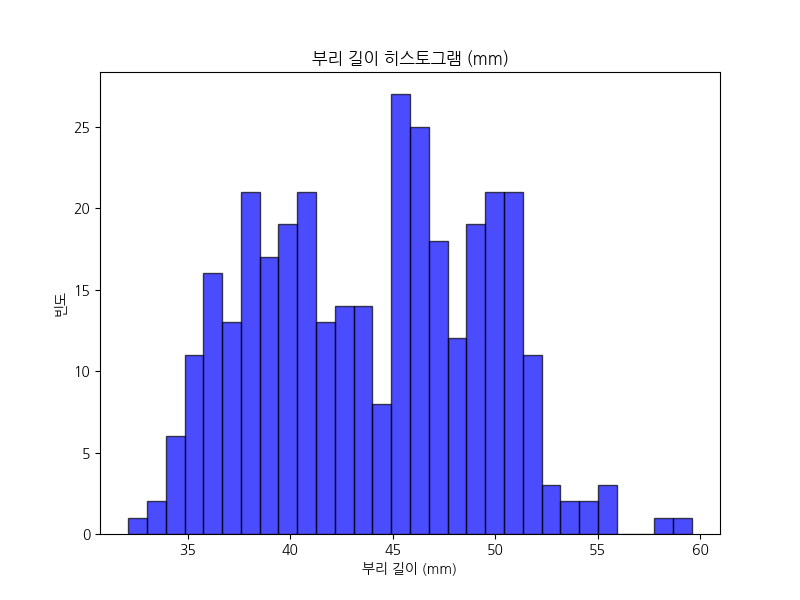

- 분포: 32-60mm, 평균 43.92mm
- 인사이트: Adelie 종이 작은 부리, Gentoo 종이 큰 부리. 먹이 습성 반영.

---

## 시각화: 부리 깊이 히스토그램

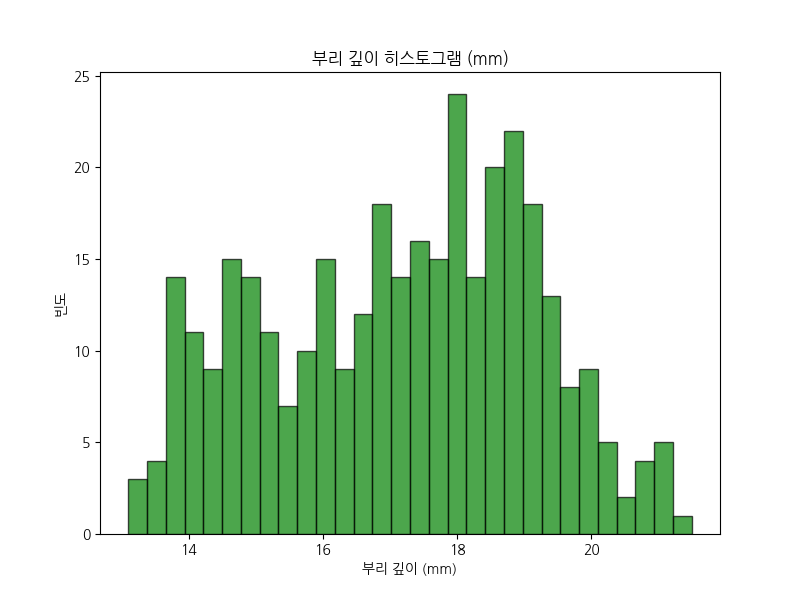

- 분포: 13-21mm, 평균 17.15mm
- 인사이트: Gentoo 종이 깊은 부리. 큰 먹이 사냥에 유리.

---

## 시각화: 날개 길이 히스토그램

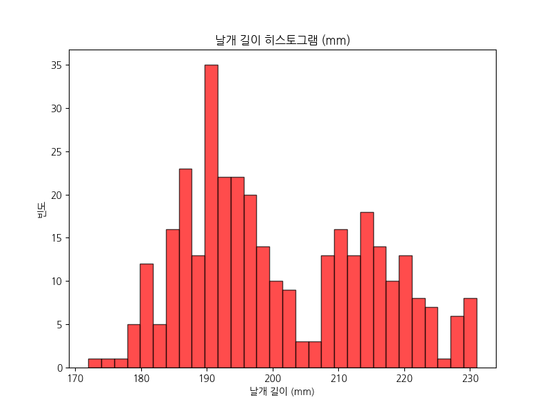

- 분포: 172-231mm, 평균 200.92mm
- 인사이트: Gentoo 종이 긴 날개. 수영 특화.

---

## 시각화: 체중 히스토그램

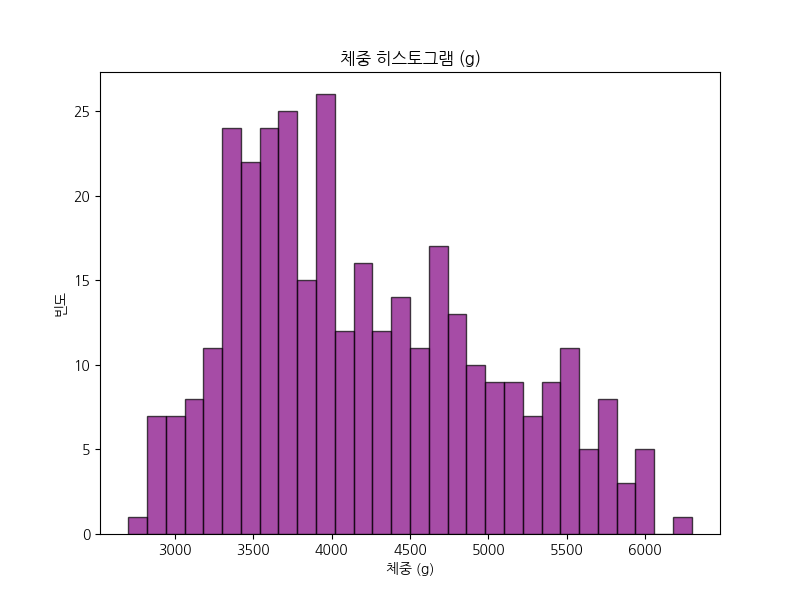

- 분포: 2700-6300g, 평균 4201.75g
- 인사이트: Gentoo 종이 무거움. 생존에 유리.

---

## 시각화: 종별 부리 길이 박스플롯

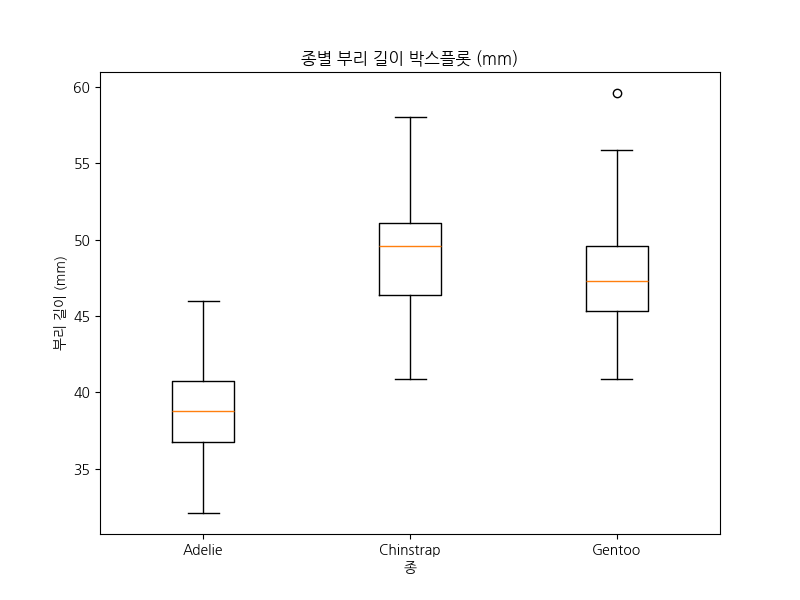

- Adelie: 짧음, Gentoo: 길고 변동성 높음
- 인사이트: 진화적 적응 차이.

---

## 시각화: 종별 체중 박스플롯

- Gentoo: 무거움, Adelie: 가벼움
- 인사이트: 서식지 품질 반영.

---

## 시각화: 부리 길이 vs 깊이 산점도

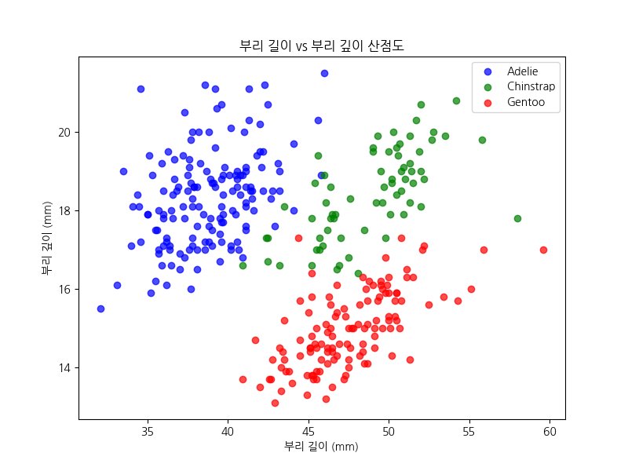

- 양의 상관관계
- 인사이트: 종별 클러스터링.

---

## 시각화: 날개 길이 vs 체중 산점도

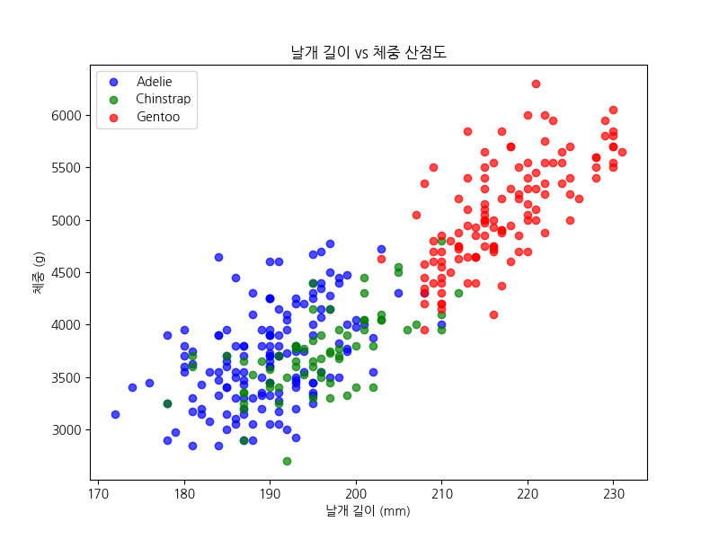

- 강한 양의 상관관계 (0.87)
- 인사이트: 크기 비례.

---

## 시각화: 종별 개수 바 차트

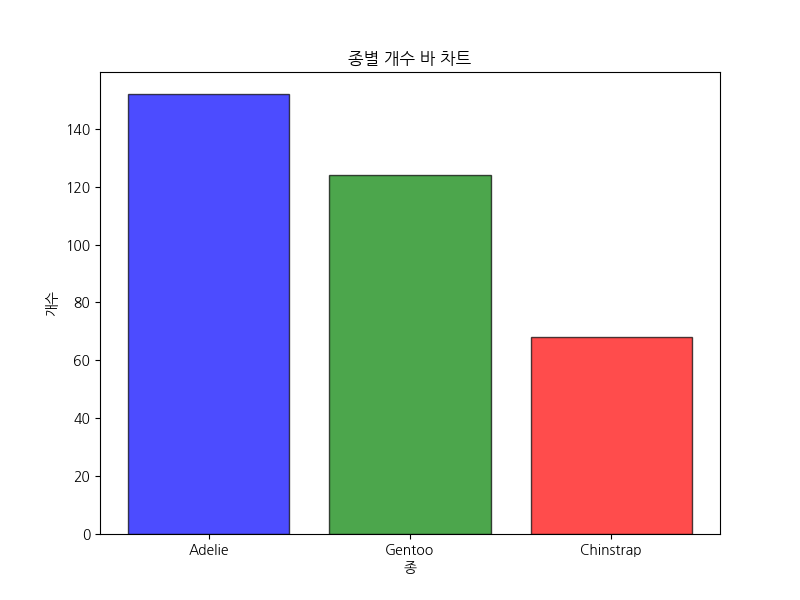

- Adelie: 152, Chinstrap: 68, Gentoo: 124
- 인사이트: 개체군 규모 차이.

---

## 시각화: 섬별 개수 바 차트

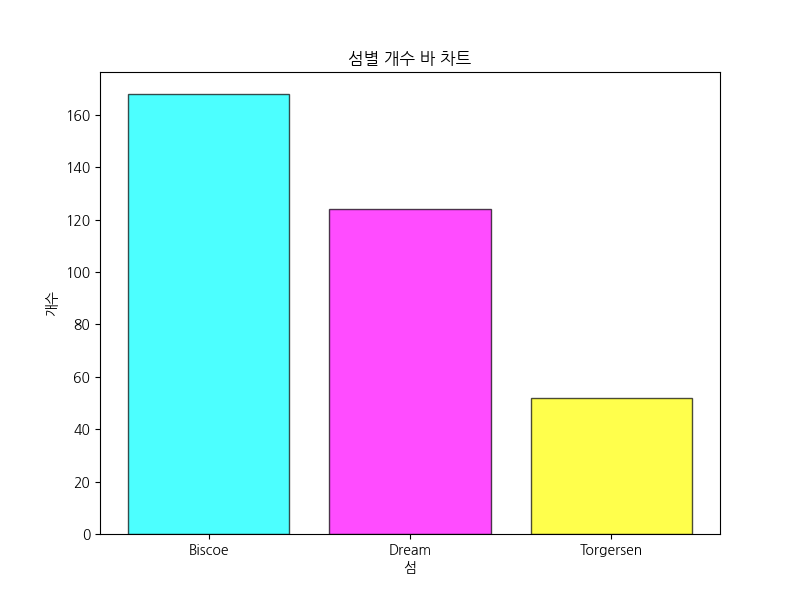

- Biscoe: 168, Dream: 124, Torgersen: 52
- 인사이트: 서식지 분포.

---

## 시각화: 성별 개수 바 차트

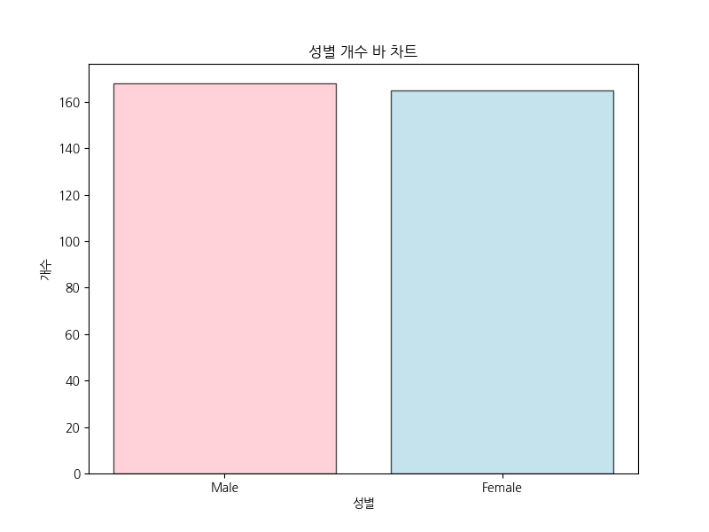

- Female: 165, Male: 168
- 인사이트: 성비 균형.

---

## 시각화: 상관관계 히트맵

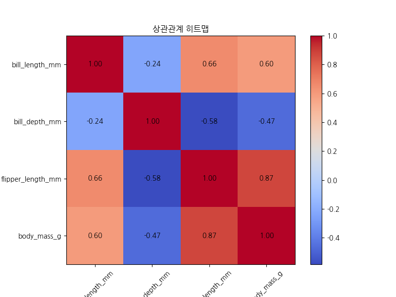

- 날개 길이-체중: 0.87
- 인사이트: 형태적 통합.

---

## 교차표: 종 vs 섬

| species   |   Biscoe |   Dream |   Torgersen |
|:----------|---------:|--------:|------------:|
| Adelie    |       44 |      56 |          52 |
| Chinstrap |        0 |      68 |           0 |
| Gentoo    |      124 |       0 |           0 |

- 인사이트: 종별 서식지 특이성.

---

## 피봇테이블: 종과 섬별 평균 체중

| species   |   Biscoe |   Dream |   Torgersen |
|:----------|---------:|--------:|------------:|
| Adelie    |  3709.66 | 3688.39 |     3706.37 |
| Chinstrap |   nan    | 3733.09 |      nan    |
| Gentoo    |  5076.02 |  nan    |      nan    |

- 인사이트: 서식지 품질 영향.

---

## 교차표: 섬 vs 종

| island    |   Adelie |   Chinstrap |   Gentoo |
|:----------|---------:|------------:|---------:|
| Biscoe    |       44 |           0 |      124 |
| Dream     |       56 |          68 |        0 |
| Torgersen |       52 |           0 |        0 |

- 인사이트: 섬별 다양성.

---

## 교차표: 성별 vs 종

| sex    |   Adelie |   Chinstrap |   Gentoo |
|:-------|---------:|------------:|---------:|
| Female |       73 |          34 |       58 |
| Male   |       73 |          34 |       61 |

- 인사이트: 성비 균형.

---

## 피봇테이블: 성별과 종별 평균 부리 길이

| sex    |   Adelie |   Chinstrap |   Gentoo |
|:-------|---------:|------------:|---------:|
| Female |  37.2575 |     46.5735 |  45.5638 |
| Male   |  40.3904 |     51.0941 |  49.4738 |

- 인사이트: 성적 이형성.

---

## 인사이트 요약

- 펭귄 종별로 형태적 차이 뚜렷
- 서식지와 먹이가 주요 요인
- 기후 변화 영향 가능성

---

## 결론

- 데이터 분석을 통해 펭귄 생태 이해
- 추가 연구 필요
- 보존 중요성 강조